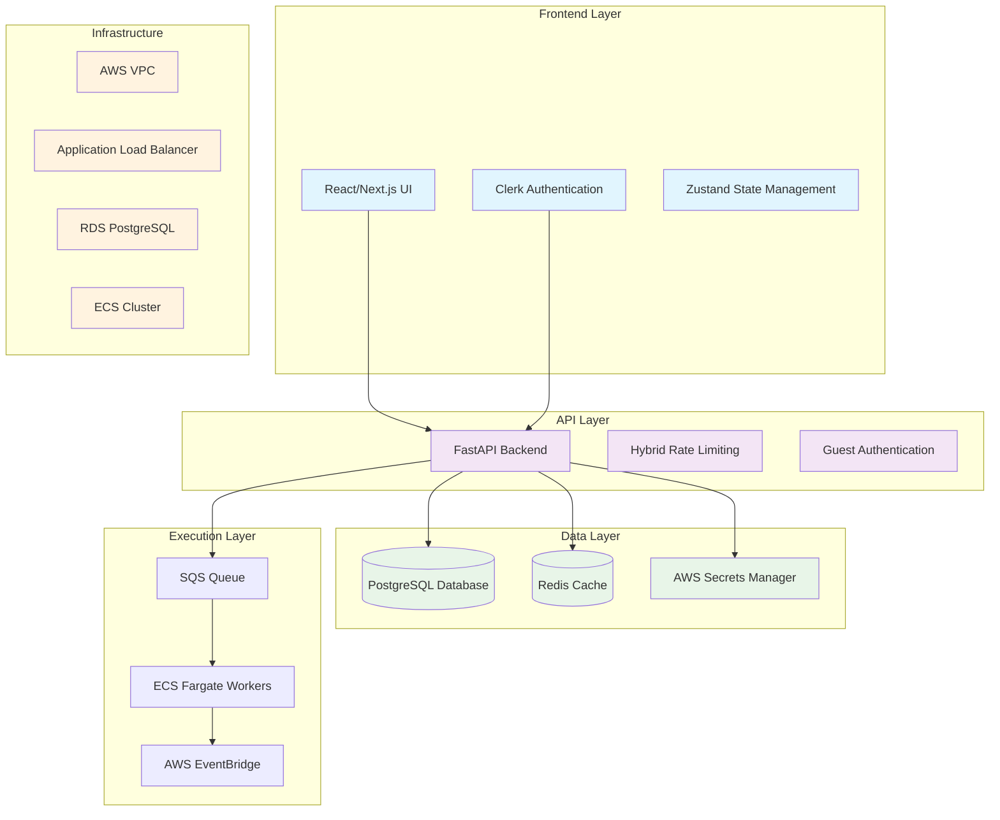

# Flow Builder - Workflow Automation Platform

A powerful, cloud-native workflow automation platform that enables users to create, schedule, and execute complex browser automation workflows through an intuitive visual interface. Built for scalability, cost-efficiency, and enterprise-grade reliability.

## What is Flow Builder?

Flow Builder is a comprehensive workflow automation solution that combines:
- **Visual Workflow Designer**: Drag-and-drop interface for creating complex automation workflows
- **Browser Automation**: Advanced web scraping and interaction capabilities with anti-detection measures
- **AI-Powered Data Extraction**: Intelligent data extraction using OpenAI integration
- **Scalable Infrastructure**: Event-driven architecture with AWS Lambda and Fargate Spot instances
- **Cost-Optimized Execution**: Zero-scale architecture that only runs when needed
- **Enterprise Security**: Comprehensive authentication, rate limiting, and credential management

## Use Cases & Value Proposition

### Target Use Cases

**E-commerce & Retail**:
- Price monitoring and competitive analysis
- Inventory tracking across multiple platforms
- Product catalog synchronization
- Review and rating aggregation
- Stock availability monitoring

**Data Intelligence & Research**:
- Market research and trend analysis
- Lead generation and contact discovery
- Social media monitoring and sentiment analysis
- News and content aggregation
- Academic research data collection

**Business Process Automation**:
- Form filling and data entry automation
- Report generation and distribution
- Customer service automation
- Compliance monitoring and reporting
- Quality assurance testing

**Financial Services**:
- Financial data aggregation
- Regulatory compliance monitoring
- Risk assessment data collection
- Market analysis and reporting
- Customer onboarding automation

### Value Proposition

**For Developers**:
- **Rapid Development**: Visual workflow builder reduces development time by 80%
- **No Infrastructure Hassle**: Managed infrastructure with auto-scaling
- **Rich Integration Library**: 50+ pre-built nodes for common tasks
- **Enterprise-Grade Security**: Built-in authentication and rate limiting

**For Businesses**:
- **Cost Efficiency**: Up to 90% cost savings with spot instances and zero-scale architecture
- **Scalability**: Handle everything from 10 to 10,000+ workflows
- **Reliability**: 99.9% uptime with automatic failover and retries
- **Compliance**: SOC 2 ready with comprehensive audit trails

**For Technical Teams**:
- **Easy Maintenance**: Managed services reduce operational overhead
- **Monitoring & Debugging**: Real-time execution monitoring with detailed logs
- **Version Control**: Complete workflow versioning and rollback capabilities
- **Team Collaboration**: Multi-user support with role-based access control

## Architecture Overview



## Features

### Core Functionality
- **Visual Workflow Builder**: Drag-and-drop interface for creating complex workflows
- **Real-time Execution**: Live monitoring of workflow executions with detailed logs
- **Credential Management**: Secure storage and management of API keys and secrets
- **Scheduling**: Cron-based workflow scheduling with timezone support
- **Version Control**: Complete workflow versioning with rollback capabilities

### Authentication & Access
- **Clerk Integration**: Secure user authentication and management
- **Guest Access**: 3-day trial with 50 credits, no signup required
- **Role-based Access**: Different permissions for guest vs authenticated users
- **Session Management**: Secure session handling with automatic cleanup

### Security & Performance
- **Hybrid Rate Limiting**: Memory/Redis-based limiting with custom guest logic
- **IP-based Protection**: Prevents abuse and multiple guest accounts
- **Encrypted Secrets**: Database and AWS Secrets Manager integration
- **Comprehensive Logging**: Detailed audit trails and execution logs

## Key Features

### Visual Workflow Builder
- **Drag-and-Drop Interface**: Intuitive workflow creation with React Flow
- **50+ Node Types**: Comprehensive library of automation building blocks
- **Real-Time Validation**: Instant feedback on workflow configuration
- **Version Control**: Complete workflow versioning with rollback capabilities

### Advanced Browser Automation
- **Multiple Browser Types**: Standard, Stealth, and Bright Data browsers
- **Anti-Detection**: Advanced fingerprinting and human-like behavior
- **Captcha Solving**: Automatic handling of Cloudflare, reCAPTCHA, and hCaptcha
- **Proxy Rotation**: Residential proxy network integration

### AI-Powered Data Extraction
- **OpenAI Integration**: GPT-4 powered intelligent data extraction
- **Structured Output**: JSON-formatted data extraction
- **Custom Prompts**: Flexible data extraction instructions
- **Cost Optimization**: Efficient token usage and caching

##Zero-Scale Infrastructure
- **Event-Driven Architecture**: Lambda scheduler + EventBridge Pipes + Fargate Spot
- **Cost Optimization**: Up to 90% savings with spot instances
- **Auto-Scaling**: Automatic scaling based on queue depth
- **Fault Tolerance**: Automatic retries and dead letter queues

### Enterprise Security
- **Dual Authentication**: Clerk integration + guest access system
- **Hybrid Rate Limiting**: Memory + Redis + database-based protection
- **Credential Management**: AWS Secrets Manager + encrypted database storage
- **IP-Based Protection**: Advanced abuse prevention

### Comprehensive Monitoring
- **Real-Time Execution**: Live workflow monitoring with detailed logs
- **Performance Metrics**: Execution time, success rates, resource usage
- **Cost Tracking**: Credit-based usage monitoring
- **Error Handling**: Detailed error logs and debugging information

## Project Structure

```
flow-builder/
├── frontend/                 # Next.js React application
│   ├── src/app/                # App router pages and layouts
│   ├── src/components/         # Reusable UI components
│   ├── src/lib/               # Utilities and API clients
│   └── src/types/             # TypeScript type definitions
├── api/                     # FastAPI backend service
│   ├── app/routers/           # API route handlers
│   ├── app/services/          # Business logic layer
│   ├── app/middleware/        # Rate limiting and auth
│   └── app/auth/              # Authentication logic
├── worker/                  # Workflow execution engine
│   ├── runner/                # Workflow execution logic
│   ├── runner/nodes/          # Node type implementations
│   └── runner/browser/        # Browser automation
├── scheduler_lambda/        # Workflow scheduler
│   ├── handler.py             # Lambda function handler
│   └── Dockerfile             # Container configuration
├── shared/                  # Shared models and utilities
│   ├── models.py              # SQLModel database models
│   ├── crud/                  # Database operations
│   └── secrets.py             # Secret management
├── infra/                   # Infrastructure as Code
│   ├── tf/modules/            # Reusable Terraform modules
│   ├── tf/environments/       # Environment configurations
│   └── tf/ultra-cost-optimized/ # Cost-optimized deployment
└── docs/                   # Comprehensive documentation
    ├── ARCHITECTURE.md        # System architecture
    ├── WORKFLOW_SYSTEM.md     # Workflow execution flow
    ├── NODES_AND_INTEGRATIONS.md # Node types and integrations
    ├── INFRASTRUCTURE.md      # Infrastructure and deployment
    ├── AUTHENTICATION_SECURITY.md # Auth and security
    └── DEVELOPER_GUIDE.md     # Development setup
```

## Technology Stack

### Frontend
- **Framework**: Next.js 14 with App Router
- **UI Library**: React with TypeScript
- **Styling**: Tailwind CSS + shadcn/ui components
- **State Management**: Zustand
- **Authentication**: Clerk
- **Workflow Editor**: React Flow

### Backend
- **Framework**: FastAPI with Python 3.10+
- **Database**: PostgreSQL with SQLModel/SQLAlchemy
- **Caching**: Redis (optional)
- **Rate Limiting**: slowapi + custom hybrid logic
- **Authentication**: Clerk + custom guest system
- **Task Queue**: AWS SQS + ECS Fargate

### Infrastructure
- **Cloud Provider**: AWS
- **Container Orchestration**: ECS Fargate
- **Database**: RDS PostgreSQL
- **Load Balancer**: Application Load Balancer
- **Secrets**: AWS Secrets Manager
- **Monitoring**: CloudWatch
- **IaC**: Terraform

## Quick Start

### Option 1: Docker Development (Recommended)

The fastest way to get started:

```bash
# Clone the repository
git clone https://github.com/your-org/flow-builder.git
cd flow-builder

# Start infrastructure services
cd infra
docker-compose up -d

# Start the API
cd ../api
pip install -r requirements.txt
cp .env.example .env
# Edit .env with your configuration
uvicorn app.main:app --reload --host 0.0.0.0 --port 8080

# Start the frontend (in a new terminal)
cd frontend
npm install
cp .env.local.example .env.local
# Edit .env.local with your configuration
npm run dev
```

**Access the application**:
- Frontend: http://localhost:3000
- Backend API: http://localhost:8080
- API Docs: http://localhost:8080/docs

### Option 2: Full Local Setup

For complete local development with all services:

```bash
# Prerequisites check
node --version    # Should be 18+
python --version  # Should be 3.10+
docker --version  # Should be 24+

# Follow the comprehensive setup guide
# See docs/DEVELOPER_GUIDE.md for detailed instructions
```

### Option 3: Cloud Deployment

Deploy to AWS with ultra-cost-optimized infrastructure:

```bash
# Set up AWS credentials
aws configure

# Deploy infrastructure
cd infra/tf/ultra-cost-optimized
terraform init
terraform plan -var-file="terraform.tfvars"
terraform apply

# Build and deploy applications
./deploy-all.sh
```

**Deployment Options**:
- **Ultra-Cost-Optimized**: ~$20-50/month (EventBridge Pipes + Fargate Spot)
- **Standard Scalable**: ~$150-200/month (Full AWS infrastructure)
- **Development**: Local Docker setup (Free)

## Rate Limiting

The application implements a hybrid rate limiting system:

### Guest Users (Stricter Limits)
- General endpoints: 20 requests/minute
- Workflows: 10 requests/minute
- Executions: 5 requests/minute
- Credentials: 10 requests/minute

### Authenticated Users (More Lenient)
- General endpoints: 100 requests/minute
- Workflows: 50 requests/minute
- Executions: 30 requests/minute
- Credentials: 30 requests/minute

### Implementation
- **Primary**: slowapi with Redis/memory storage for speed
- **Secondary**: Custom database logic for guest-specific rules
- **Fallback**: IP-based limiting for unauthenticated requests

## Guest Access System

### Features
- **No Signup Required**: Instant access with 50 credits
- **3-Day Trial**: Full feature access for 72 hours
- **IP Protection**: One guest session per IP address
- **Automatic Cleanup**: Expired accounts removed automatically
- **Seamless Conversion**: Preserve data when upgrading to full account

### Workflow
1. Visit `/guest` page
2. Click "Start Free Trial"
3. Receive 50 credits instantly
4. Use all features for 3 days
5. Convert to full account anytime (get 200 credits)
6. Account auto-deletes if not converted

## Documentation

### Architecture & System Design
- **[System Architecture](docs/ARCHITECTURE.md)** - Complete system overview and component interaction
- **[Workflow System](docs/WORKFLOW_SYSTEM.md)** - Detailed workflow execution flow and scheduling
- **[Infrastructure](docs/INFRASTRUCTURE.md)** - AWS services, Terraform modules, and deployment strategies

### Development & Integration
- **[Nodes & Integrations](docs/NODES_AND_INTEGRATIONS.md)** - All workflow node types and external integrations
- **[Authentication & Security](docs/AUTHENTICATION_SECURITY.md)** - Auth system, rate limiting, and security features

### Component Documentation
- **[API Documentation](api/README.md)** - FastAPI backend service details
- **[Frontend Guide](frontend/README.md)** - Next.js application development
- **[Worker Service](worker/README.md)** - Workflow execution engine
- **[Scheduler Lambda](scheduler_lambda/README.md)** - Workflow scheduling service
- **[Infrastructure Setup](infra/README.md)** - Local development infrastructure

## Testing & Quality Assurance

### Running Tests

**Backend Tests**:
```bash
cd api
pytest                          # Run all tests
pytest --cov=app tests/        # Run with coverage
pytest tests/test_workflows.py # Run specific test file
```

**Frontend Tests**:
```bash
cd frontend
npm test                # Unit tests
npm run test:e2e       # End-to-end tests
npm run test:watch     # Watch mode
```

**Integration Tests**:
```bash
# Start services
docker-compose up -d

# Run integration tests
cd api
pytest tests/integration/

# Test workflow execution
cd worker
python -m pytest tests/
```

### Code Quality

**Linting & Formatting**:
```bash
# Backend
cd api
black .                 # Format Python code
isort .                 # Sort imports
flake8 .               # Lint Python code
mypy .                 # Type checking

# Frontend
cd frontend
npm run lint           # ESLint
npm run format         # Prettier
npm run type-check     # TypeScript
```

<div align="center">

**⭐ Star this repository if you find it useful!**
