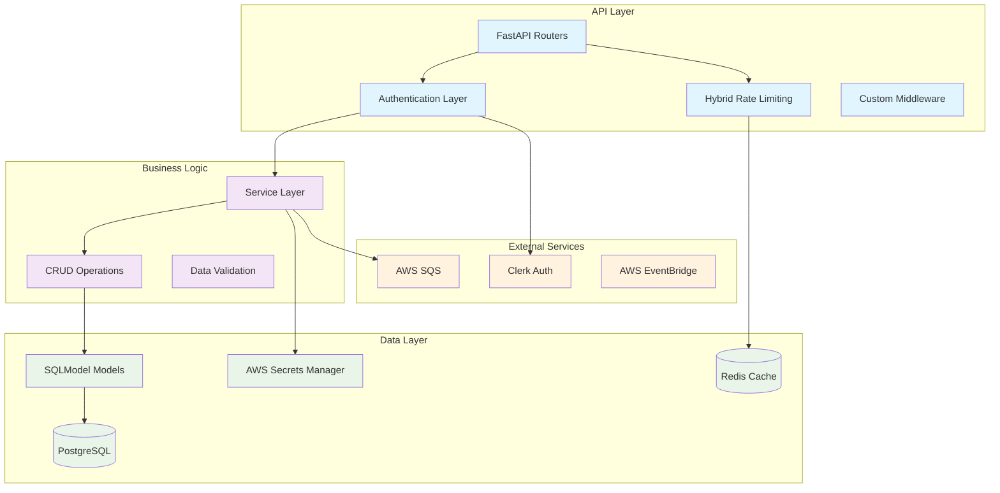

# Flow Builder API

FastAPI backend service for the Flow Builder workflow automation platform.

## Architecture



## Features

### Core API Features
- **RESTful API**: Clean, consistent REST endpoints
- **OpenAPI Documentation**: Auto-generated API docs at `/docs`
- **Type Safety**: Full TypeScript-like typing with Pydantic
- **Async/Await**: High-performance async request handling
- **Database ORM**: SQLModel for type-safe database operations

### Authentication & Authorization
- **Clerk Integration**: Secure JWT token validation
- **Guest Access**: Custom guest session management
- **Role-based Access**: Different permissions for user types
- **Session Validation**: Automatic session expiry and cleanup

### Security & Performance
- **Hybrid Rate Limiting**: Memory + Redis-based rate limiting
- **Input Validation**: Comprehensive request validation
- **SQL Injection Protection**: Parameterized queries
- **CORS Configuration**: Secure cross-origin requests
- **Error Handling**: Structured error responses

## Environment Variables

| Variable | Description | Default |
|----------|-------------|---------|
| `DB_HOST` | Database host | `localhost` |
| `DB_PORT` | Database port | `5433` |
| `DB_NAME` | Database name | `flow-builder` |
| `DB_USER` | Database username | `root` |
| `DB_PASSWORD` | Database password | `-` |
| `DB_SSL_MODE` | SSL mode for database connection | `require` |
| `CLERK_SECRET_KEY` | Clerk API secret key | - |
| `CLERK_FRONTEND_URL` | Clerk frontend URL | - |
| `WORKFLOW_QUEUE_URL` | SQS queue URL for workflow requests | - |
| `SQS_ENDPOINT_URL` | Custom SQS endpoint URL (for LocalStack) | - |
| `AWS_REGION` | AWS region | `us-east-1` |
| `USE_DB_SECRETS` | Whether to use database-stored secrets | `false` |

## API Endpoints

### Workflows

- `GET /api/workflows`: List all workflows for the authenticated user
- `POST /api/workflows`: Create a new workflow
- `GET /api/workflows/{workflow_id}`: Get a specific workflow
- `PUT /api/workflows/{workflow_id}`: Update a workflow
- `DELETE /api/workflows/{workflow_id}`: Delete a workflow
- `POST /api/workflows/{workflow_id}/execute`: Execute a workflow

### Executions

- `GET /api/executions`: List all executions for the authenticated user
- `GET /api/executions/{execution_id}`: Get a specific execution
- `GET /api/workflows/{workflow_id}/executions`: List executions for a specific workflow

### Credentials

- `GET /api/credentials`: List all credentials for the authenticated user
- `POST /api/credentials`: Create a new credential
- `GET /api/credentials/{credential_id}`: Get a specific credential
- `DELETE /api/credentials/{credential_id}`: Delete a credential

## Running Locally

1. Install dependencies:
```bash
pip install -r requirements.txt
```

2. Set up environment variables (create a `.env` file or export them)

3. Run the API server:
```bash
uvicorn app.main:app --reload
```

4. Access the API documentation at http://localhost:8000/docs

## Deployment

The API service can be deployed as a Docker container to AWS ECS. See the infrastructure documentation for details.