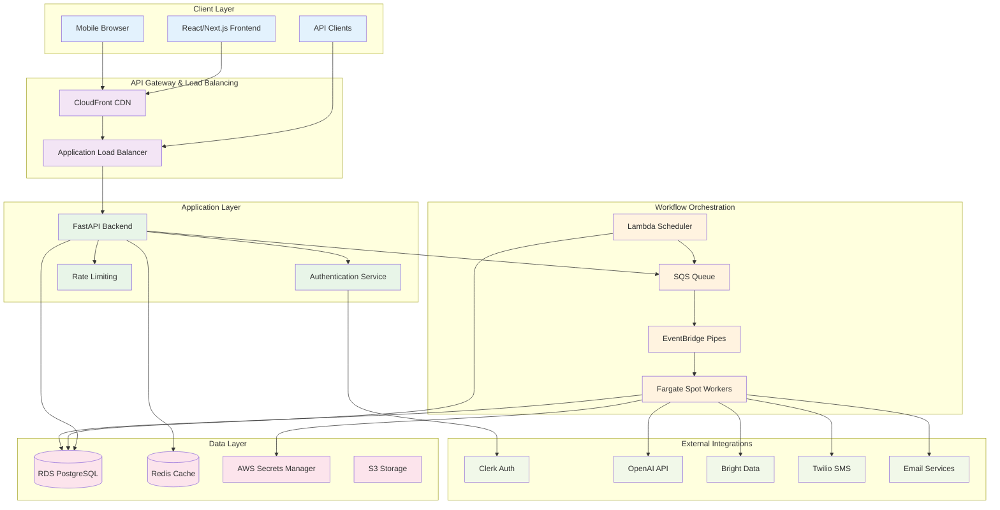
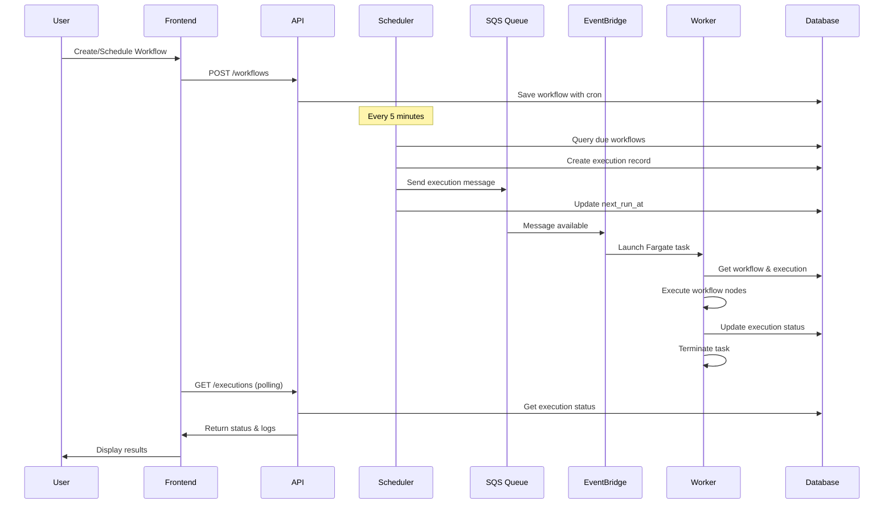

# Flow Builder Architecture

This document provides a comprehensive overview of the Flow Builder system architecture, explaining how all components work together to deliver a scalable, cost-efficient workflow automation platform.

## System Overview

Flow Builder is built on a modern, cloud-native architecture that emphasizes:
- **Event-driven processing** for optimal resource utilization
- **Zero-scale infrastructure** that only runs when needed
- **Microservices architecture** with clear separation of concerns
- **Cost optimization** through Fargate Spot instances and Lambda functions
- **Enterprise security** with comprehensive authentication and rate limiting

## High-Level Architecture

## Core Components

### 1. Frontend Layer

**Technology Stack:**
- Next.js 14 with App Router
- React with TypeScript
- Tailwind CSS + shadcn/ui components
- Zustand for state management
- React Flow for workflow visualization

**Key Features:**
- Visual workflow builder with drag-and-drop interface
- Real-time execution monitoring
- Dark/light theme support
- Responsive design for mobile and desktop
- Guest access without registration

### 2. API Layer

**Technology Stack:**
- FastAPI with Python 3.10+
- SQLModel/SQLAlchemy for ORM
- Pydantic for data validation
- Redis for caching (optional)

**Key Features:**
- RESTful API with OpenAPI documentation
- Hybrid rate limiting (memory + Redis + database)
- Unified authentication (Clerk + guest system)
- Comprehensive input validation
- Structured error handling

### 3. Workflow Orchestration

This is the heart of the system, implementing an event-driven architecture for cost-efficient workflow execution.

#### Lambda Scheduler
- **Trigger**: EventBridge rule (every 5 minutes)
- **Function**: Query database for due workflows
- **Actions**: 
  - Create execution records
  - Send messages to SQS queue
  - Update next run times
  - Clean up expired guest accounts

#### SQS Queue
- **Purpose**: Decouple scheduling from execution
- **Configuration**: Standard queue with dead letter queue
- **Message Format**: JSON with workflow and execution IDs

#### EventBridge Pipes
- **Function**: Connect SQS to ECS Fargate tasks
- **Benefit**: True zero-scale architecture
- **Configuration**: Batch size 1 for individual message processing

#### Fargate Spot Workers
- **Runtime**: ECS Fargate Spot instances
- **Image**: Custom Docker image with Playwright/Patchright
- **Scaling**: Automatic based on queue depth
- **Cost**: Up to 90% savings compared to on-demand

### 4. Data Layer

#### PostgreSQL Database (RDS)
- **Purpose**: Primary data store
- **Tables**: Users, workflows, executions, credentials, phases, logs
- **Features**: ACID compliance, backup, encryption at rest

#### Redis Cache (Optional)
- **Purpose**: Rate limiting and session caching
- **Configuration**: ElastiCache for production
- **Fallback**: Memory-based for development

#### AWS Secrets Manager
- **Purpose**: Secure credential storage
- **Integration**: Automatic rotation, encryption
- **Fallback**: Database encryption for cost optimization

## Workflow Execution Flow

## Security Architecture

### Authentication & Authorization

1. **Clerk Integration**
   - JWT token validation
   - Social login support
   - User management
   - Session handling

2. **Guest Access System**
   - IP-based session tracking
   - 3-day trial period
   - Credit-based usage limits
   - Automatic cleanup

### Rate Limiting

**Hybrid Approach:**
1. **Primary**: slowapi with Redis/memory storage
2. **Secondary**: Database-based guest-specific rules
3. **Fallback**: IP-based limiting

**Rate Limits:**
- Guest users: 20 requests/minute (general), 5 executions/minute
- Authenticated users: 100 requests/minute (general), 30 executions/minute

### Credential Management

**Dual Storage System:**
1. **AWS Secrets Manager**: Production-grade security
2. **Database Encryption**: Cost-optimized alternative

**Security Features:**
- AES-256 encryption
- Key derivation with salt
- User-scoped access
- Automatic cleanup

## Infrastructure Architecture

### AWS Services Used

1. **Compute**
   - Lambda (scheduler)
   - ECS Fargate Spot (workers)
   - EC2 (API hosting - optional)

2. **Storage**
   - RDS PostgreSQL (primary database)
   - ElastiCache Redis (caching)
   - S3 (static assets, backups)

3. **Networking**
   - VPC with public/private subnets
   - Application Load Balancer
   - CloudFront CDN
   - Route 53 DNS

4. **Security**
   - IAM roles and policies
   - Secrets Manager
   - VPC security groups
   - SSL/TLS certificates

5. **Monitoring**
   - CloudWatch logs and metrics
   - EventBridge rules
   - SNS notifications

### Cost Optimization Strategies

1. **Zero-Scale Architecture**
   - Workers only run when processing messages
   - No idle compute costs
   - Automatic scaling based on queue depth

2. **Fargate Spot Instances**
   - Up to 90% cost savings
   - Automatic failover to on-demand if needed
   - Suitable for fault-tolerant workloads

3. **Resource Right-Sizing**
   - Lambda: 512MB memory, 5-minute timeout
   - Workers: 2 vCPU, 4GB memory
   - Database: Burstable instances for development

4. **Storage Optimization**
   - Database encryption instead of Secrets Manager
   - S3 lifecycle policies
   - CloudFront caching

## Scalability Considerations

### Horizontal Scaling

1. **API Layer**
   - Multiple API instances behind load balancer
   - Stateless design for easy scaling
   - Database connection pooling

2. **Worker Layer**
   - Automatic scaling based on SQS queue depth
   - Independent task execution
   - Fault tolerance with dead letter queues

3. **Database Layer**
   - Read replicas for read-heavy workloads
   - Connection pooling
   - Query optimization

### Performance Optimization

1. **Caching Strategy**
   - Redis for session data
   - Application-level caching
   - CDN for static assets

2. **Database Optimization**
   - Proper indexing
   - Query optimization
   - Connection pooling

3. **Async Processing**
   - Non-blocking I/O
   - Async/await patterns
   - Background task processing

## Monitoring & Observability

### Logging

1. **Structured Logging**
   - JSON format for all services
   - Correlation IDs for tracing
   - Different log levels (DEBUG, INFO, WARN, ERROR)

2. **Centralized Logging**
   - CloudWatch Logs for AWS services
   - Application logs with context
   - Error tracking and alerting

### Metrics

1. **Application Metrics**
   - Request rates and latency
   - Error rates and types
   - User activity and engagement

2. **Infrastructure Metrics**
   - Resource utilization
   - Queue depth and processing time
   - Database performance

### Alerting

1. **Critical Alerts**
   - Service failures
   - High error rates
   - Resource exhaustion

2. **Operational Alerts**
   - Queue backlog
   - Unusual activity patterns
   - Performance degradation

This architecture provides a robust, scalable, and cost-efficient foundation for the Flow Builder platform, capable of handling everything from development workloads to enterprise-scale deployments.
