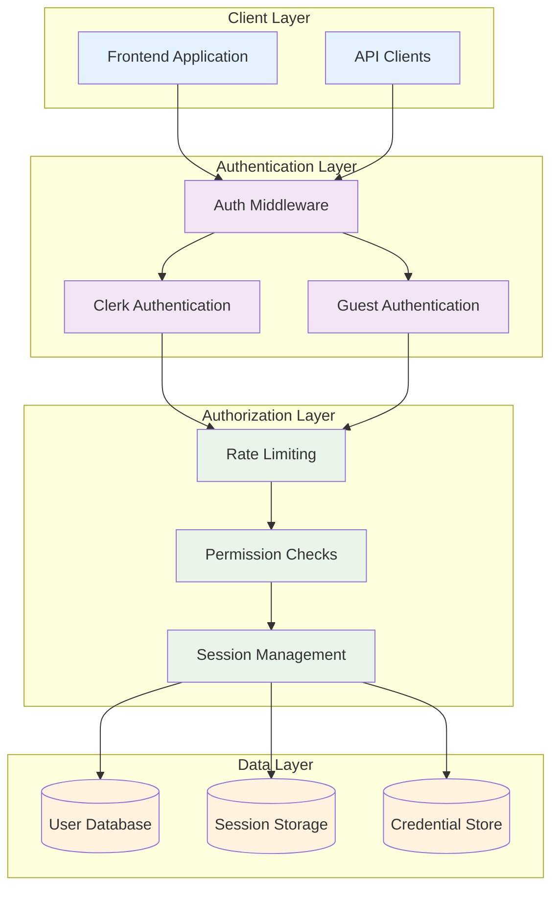
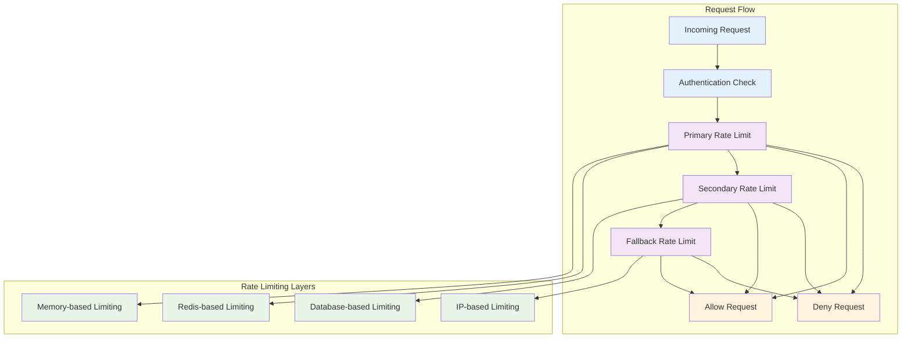
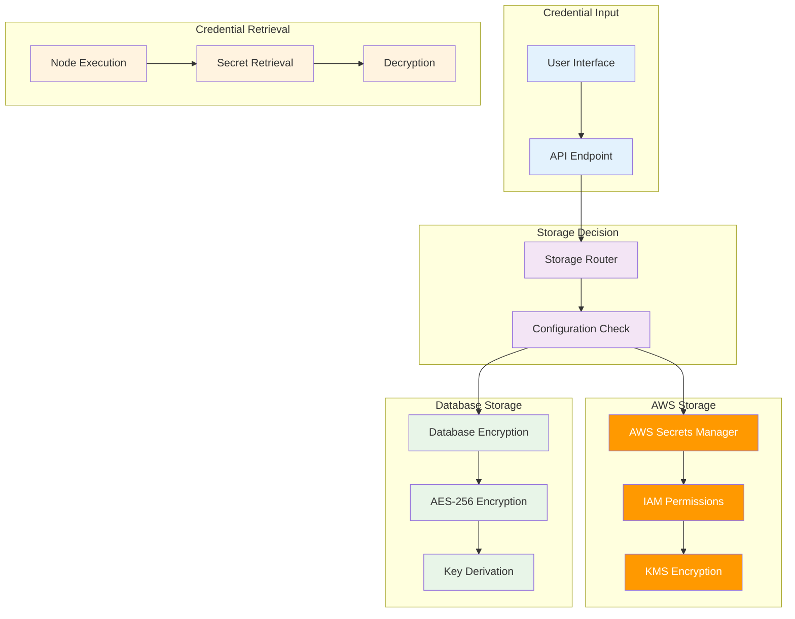

# Authentication and Security Documentation

This document provides comprehensive documentation of the Flow Builder authentication system, guest access, rate limiting, credential management, and security features.

## Authentication Architecture

Flow Builder implements a dual authentication system that supports both traditional user accounts and guest access:



## Clerk Authentication

### Overview

Clerk provides enterprise-grade authentication with support for multiple authentication methods and comprehensive user management.

### Features

**Authentication Methods**:
- Email/password authentication
- Social logins (Google, GitHub, Discord, etc.)
- Magic link authentication
- Multi-factor authentication (MFA)
- Single Sign-On (SSO)

**User Management**:
- User profile management
- Email verification
- Password reset flows
- Account deletion and data export
- User metadata and custom fields

### Implementation

**Frontend Integration**:
```typescript
// Clerk provider setup
import { ClerkProvider } from '@clerk/nextjs'

export default function RootLayout({
  children,
}: {
  children: React.ReactNode
}) {
  return (
    <ClerkProvider>
      <html lang="en">
        <body>{children}</body>
      </html>
    </ClerkProvider>
  )
}

// Protected route component
import { auth } from '@clerk/nextjs'
import { redirect } from 'next/navigation'

export default function ProtectedPage() {
  const { userId } = auth()
  
  if (!userId) {
    redirect('/sign-in')
  }
  
  return <div>Protected content</div>
}
```

**Backend Integration**:
```python
from clerk_backend_api import Clerk
from clerk_backend_api.jwks_helpers import authenticate_request

clerk_client = Clerk(bearer_auth=os.getenv("CLERK_SECRET_KEY"))

async def verify_clerk_token(request: Request) -> Optional[Dict[str, Any]]:
    """Verify Clerk JWT token and return user payload."""
    try:
        httpx_request = httpx.Request(
            method=request.method,
            url=str(request.url),
            headers=request.headers,
            content=await request.body(),
        )

        request_state = authenticate_request(
            clerk_client,
            httpx_request,
            AuthenticateRequestOptions(),
        )

        if not request_state.is_signed_in:
            raise HTTPException(status_code=401, detail="Unauthorized")

        return request_state.payload
    except Exception as e:
        raise HTTPException(status_code=401, detail=f"Unauthorized: {str(e)}")
```

### JWT Token Structure

**Token Payload**:
```json
{
  "sub": "user_2abc123def456",
  "iss": "https://clerk.your-domain.com",
  "aud": "your-frontend-api",
  "exp": 1640995200,
  "iat": 1640991600,
  "azp": "your-frontend-api",
  "email": "user@example.com",
  "email_verified": true,
  "given_name": "John",
  "family_name": "Doe",
  "picture": "https://img.clerk.com/...",
  "metadata": {
    "credits": 1000,
    "subscription_tier": "pro"
  }
}
```

## Guest Authentication System

### Overview

The guest authentication system provides immediate access to the platform without requiring user registration, enabling users to try the service with limited functionality.

### Features

**Guest Access Benefits**:
- **No Registration Required**: Instant access to the platform
- **3-Day Trial Period**: Full feature access for 72 hours
- **50 Initial Credits**: Sufficient for testing workflows
- **IP-Based Protection**: One guest session per IP address
- **Seamless Conversion**: Preserve data when upgrading to full account

### Implementation

**Guest Session Creation**:
```python
class GuestAuthManager:
    def __init__(self):
        self.session_duration = timedelta(days=3)
        self.initial_credits = 50
        self.max_credits_after_signup = 200

    async def create_guest_session(
        self, 
        session: AsyncSession, 
        ip_address: str
    ) -> GuestSession:
        """Create a new guest session for the given IP address."""
        
        # Check if IP already has an active session
        existing_session = await self.get_active_session_by_ip(session, ip_address)
        if existing_session:
            return existing_session
        
        # Create new guest user
        guest_user = User(
            email=f"guest_{uuid4().hex[:8]}@guest.local",
            is_guest=True,
            guest_ip=ip_address,
            guest_expires_at=datetime.now(timezone.utc) + self.session_duration
        )
        session.add(guest_user)
        await session.flush()
        
        # Create initial credit balance
        balance = UserBalance(
            user_id=guest_user.id,
            credits=self.initial_credits
        )
        session.add(balance)
        
        # Create guest session
        guest_session = GuestSession(
            user_id=guest_user.id,
            ip_address=ip_address,
            session_token=secrets.token_urlsafe(32),
            expires_at=guest_user.guest_expires_at
        )
        session.add(guest_session)
        
        await session.commit()
        return guest_session

    async def cleanup_expired_guests(self, session: AsyncSession) -> Dict[str, int]:
        """Clean up expired guest accounts and sessions."""
        cutoff_time = datetime.now(timezone.utc)
        
        # Find expired guest users
        expired_users = await session.exec(
            select(User).where(
                User.is_guest == True,
                User.guest_expires_at < cutoff_time
            )
        )
        
        cleanup_stats = {
            "cleaned_up_guests": 0,
            "cleaned_up_sessions": 0
        }
        
        for user in expired_users:
            # Delete associated data (workflows, executions, credentials)
            await self._delete_user_data(session, user.id)
            
            # Delete user
            await session.delete(user)
            cleanup_stats["cleaned_up_guests"] += 1
        
        # Clean up orphaned sessions
        expired_sessions = await session.exec(
            select(GuestSession).where(
                GuestSession.expires_at < cutoff_time
            )
        )
        
        for guest_session in expired_sessions:
            await session.delete(guest_session)
            cleanup_stats["cleaned_up_sessions"] += 1
        
        await session.commit()
        return cleanup_stats
```

**Guest Session Validation**:
```python
async def validate_guest_session(
    session: AsyncSession, 
    session_token: str, 
    ip_address: str
) -> Optional[User]:
    """Validate guest session token and IP address."""
    
    guest_session = await session.exec(
        select(GuestSession)
        .where(
            GuestSession.session_token == session_token,
            GuestSession.ip_address == ip_address,
            GuestSession.expires_at > datetime.now(timezone.utc)
        )
        .options(selectinload(GuestSession.user))
    ).first()
    
    if not guest_session:
        return None
    
    # Check if user is still valid
    if (guest_session.user.guest_expires_at and 
        guest_session.user.guest_expires_at < datetime.now(timezone.utc)):
        return None
    
    return guest_session.user
```

### Guest Conversion Process

**Upgrade to Full Account**:
```python
async def convert_guest_to_user(
    session: AsyncSession,
    guest_user: User,
    clerk_user_id: str,
    email: str
) -> User:
    """Convert guest account to full user account."""
    
    # Update user record
    guest_user.clerk_user_id = clerk_user_id
    guest_user.email = email
    guest_user.is_guest = False
    guest_user.guest_ip = None
    guest_user.guest_expires_at = None
    
    # Upgrade credits to full account limit
    balance = await session.exec(
        select(UserBalance).where(UserBalance.user_id == guest_user.id)
    ).first()
    
    if balance and balance.credits < self.max_credits_after_signup:
        balance.credits = self.max_credits_after_signup
    
    # Remove guest session
    guest_sessions = await session.exec(
        select(GuestSession).where(GuestSession.user_id == guest_user.id)
    )
    for guest_session in guest_sessions:
        await session.delete(guest_session)
    
    await session.commit()
    return guest_user
```

## Unified Authentication Middleware

### Implementation

The unified authentication middleware handles both Clerk and guest authentication seamlessly:

```python
async def verify_user_or_guest(request: Request) -> Dict[str, Any]:
    """Unified authentication that supports both Clerk and guest users."""
    
    # Try Clerk authentication first
    try:
        clerk_payload = await verify_clerk_token(request)
        return {
            "type": "clerk",
            "payload": clerk_payload,
            "user_id": clerk_payload["sub"]
        }
    except HTTPException:
        pass
    
    # Try guest authentication
    guest_token = request.headers.get("X-Guest-Token")
    if guest_token:
        ip_address = get_client_ip(request)
        guest_user = await validate_guest_session(
            session=get_session(),
            session_token=guest_token,
            ip_address=ip_address
        )
        
        if guest_user:
            return {
                "type": "guest",
                "payload": {"sub": str(guest_user.id)},
                "user_id": str(guest_user.id),
                "user": guest_user
            }
    
    # No valid authentication found
    raise HTTPException(status_code=401, detail="Authentication required")

async def get_current_user_from_auth(
    auth_data: Dict[str, Any], 
    session: AsyncSession
) -> User:
    """Get user object from authentication data."""
    
    if auth_data["type"] == "clerk":
        # Get or create user from Clerk data
        clerk_user_id = auth_data["user_id"]
        user = await get_user_by_clerk_id(session, clerk_user_id)
        
        if not user:
            # Create new user from Clerk data
            user = await create_user_from_clerk(session, auth_data["payload"])
        
        return user
    
    elif auth_data["type"] == "guest":
        # Return guest user directly
        return auth_data["user"]
    
    else:
        raise HTTPException(status_code=401, detail="Invalid authentication type")
```

## Rate Limiting System

### Hybrid Rate Limiting Architecture

Flow Builder implements a sophisticated hybrid rate limiting system that combines multiple strategies for optimal performance and security:



### Rate Limiting Implementation

**Primary Rate Limiting (slowapi + Redis)**:
```python
from slowapi import Limiter, _rate_limit_exceeded_handler
from slowapi.util import get_remote_address
from slowapi.errors import RateLimitExceeded

# Initialize limiter with Redis backend
limiter = Limiter(
    key_func=get_remote_address,
    storage_uri=os.getenv("REDIS_URL", "memory://"),
    default_limits=["1000 per hour"]
)

# Rate limit decorators for different endpoints
def general_rate_limit(request: Request):
    return limiter.limit("100/minute")(request)

def workflows_rate_limit(request: Request):
    return limiter.limit("50/minute")(request)

def executions_rate_limit(request: Request):
    return limiter.limit("30/minute")(request)

def credentials_rate_limit(request: Request):
    return limiter.limit("30/minute")(request)
```

**Secondary Rate Limiting (Database-based)**:
```python
async def check_hybrid_rate_limit(
    request: Request, 
    session: AsyncSession, 
    user: User
) -> None:
    """Check additional rate limits for guest users and high-volume scenarios."""
    
    if not user.is_guest:
        return  # Only apply additional limits to guest users
    
    ip_address = get_client_ip(request)
    endpoint = request.url.path
    
    # Check guest-specific rate limits
    rate_limit_key = f"guest:{ip_address}:{endpoint}"
    
    # Get current request count from database
    current_count = await get_rate_limit_count(
        session, rate_limit_key, window_minutes=1
    )
    
    # Define guest-specific limits
    guest_limits = {
        "/api/workflows": 10,      # 10 requests per minute
        "/api/executions": 5,      # 5 requests per minute
        "/api/credentials": 10,    # 10 requests per minute
        "default": 20              # 20 requests per minute for other endpoints
    }
    
    limit = guest_limits.get(endpoint, guest_limits["default"])
    
    if current_count >= limit:
        raise HTTPException(
            status_code=429,
            detail=f"Rate limit exceeded for guest users: {limit} requests per minute"
        )
    
    # Record this request
    await record_rate_limit_request(session, rate_limit_key)
```

### Rate Limiting Configuration

**User Type-Based Limits**:

| Endpoint Category | Guest Users | Authenticated Users |
|------------------|-------------|-------------------|
| General API | 20/minute | 100/minute |
| Workflows | 10/minute | 50/minute |
| Executions | 5/minute | 30/minute |
| Credentials | 10/minute | 30/minute |
| File Uploads | 5/minute | 20/minute |

**IP-Based Protection**:
```python
async def check_ip_rate_limit(request: Request, session: AsyncSession) -> None:
    """Check IP-based rate limits for unauthenticated requests."""
    
    ip_address = get_client_ip(request)
    
    # Check for suspicious activity patterns
    recent_requests = await get_recent_requests_by_ip(
        session, ip_address, minutes=5
    )
    
    if recent_requests > 100:  # More than 100 requests in 5 minutes
        # Implement progressive penalties
        penalty_duration = min(recent_requests // 50, 60)  # Up to 60 minutes
        
        await record_ip_penalty(session, ip_address, penalty_duration)
        
        raise HTTPException(
            status_code=429,
            detail=f"IP temporarily blocked due to excessive requests. "
                   f"Try again in {penalty_duration} minutes."
        )
```

## Credential Management System

### Overview

Flow Builder implements a dual credential storage system that balances security and cost efficiency:

1. **AWS Secrets Manager**: Enterprise-grade security for production
2. **Database Encryption**: Cost-optimized alternative for development

### Credential Storage Architecture



### AWS Secrets Manager Integration

**Secret Creation**:
```python
import boto3
from botocore.exceptions import ClientError

async def create_aws_secret(
    secret_name: str, 
    secret_value: str, 
    user_id: str
) -> str:
    """Create a secret in AWS Secrets Manager."""
    
    secrets_client = boto3.client('secretsmanager')
    
    # Create unique secret name with user prefix
    full_secret_name = f"flow-builder/{user_id}/{secret_name}"
    
    try:
        response = secrets_client.create_secret(
            Name=full_secret_name,
            SecretString=secret_value,
            Description=f"Flow Builder credential for user {user_id}",
            Tags=[
                {
                    'Key': 'Application',
                    'Value': 'FlowBuilder'
                },
                {
                    'Key': 'UserId',
                    'Value': user_id
                },
                {
                    'Key': 'Environment',
                    'Value': os.getenv('ENVIRONMENT', 'dev')
                }
            ]
        )
        
        return response['ARN']
        
    except ClientError as e:
        if e.response['Error']['Code'] == 'ResourceExistsException':
            # Update existing secret
            secrets_client.update_secret(
                SecretId=full_secret_name,
                SecretString=secret_value
            )
            
            # Get ARN of existing secret
            response = secrets_client.describe_secret(SecretId=full_secret_name)
            return response['ARN']
        else:
            raise ValueError(f"Failed to create secret: {str(e)}")

async def retrieve_aws_secret(secret_arn: str) -> str:
    """Retrieve a secret from AWS Secrets Manager."""
    
    secrets_client = boto3.client('secretsmanager')
    
    try:
        response = secrets_client.get_secret_value(SecretId=secret_arn)
        return response['SecretString']
        
    except ClientError as e:
        raise ValueError(f"Failed to retrieve secret: {str(e)}")
```

### Database Encryption System

**Encryption Implementation**:
```python
import os
from cryptography.fernet import Fernet
from cryptography.hazmat.primitives import hashes
from cryptography.hazmat.primitives.kdf.pbkdf2 import PBKDF2HMAC
import base64

class DatabaseSecretManager:
    def __init__(self):
        self.salt = os.getenv('SECRET_ENCRYPTION_SALT', 'flow-builder-salt').encode()
        self.password = os.getenv('SECRET_ENCRYPTION_PASSWORD', 'dev-password').encode()
        self._fernet = None
    
    def _get_fernet(self) -> Fernet:
        """Get or create Fernet encryption instance."""
        if self._fernet is None:
            kdf = PBKDF2HMAC(
                algorithm=hashes.SHA256(),
                length=32,
                salt=self.salt,
                iterations=100000,
            )
            key = base64.urlsafe_b64encode(kdf.derive(self.password))
            self._fernet = Fernet(key)
        return self._fernet
    
    def encrypt_secret(self, secret_value: str) -> str:
        """Encrypt a secret value for database storage."""
        fernet = self._get_fernet()
        encrypted_bytes = fernet.encrypt(secret_value.encode())
        return base64.urlsafe_b64encode(encrypted_bytes).decode()
    
    def decrypt_secret(self, encrypted_value: str) -> str:
        """Decrypt a secret value from database storage."""
        fernet = self._get_fernet()
        encrypted_bytes = base64.urlsafe_b64decode(encrypted_value.encode())
        decrypted_bytes = fernet.decrypt(encrypted_bytes)
        return decrypted_bytes.decode()

async def create_db_secret(
    session: AsyncSession,
    secret_name: str,
    secret_value: str,
    user_id: str
) -> str:
    """Create an encrypted secret in the database."""
    
    secret_manager = DatabaseSecretManager()
    encrypted_value = secret_manager.encrypt_secret(secret_value)
    
    # Create database secret record
    db_secret = DatabaseSecret(
        user_id=user_id,
        name=secret_name,
        encrypted_value=encrypted_value,
        created_at=datetime.now(timezone.utc)
    )
    
    session.add(db_secret)
    await session.commit()
    await session.refresh(db_secret)
    
    # Return database secret ID with prefix
    return f"db:{db_secret.id}"

async def retrieve_db_secret(
    session: AsyncSession,
    secret_id: str,
    user_id: str
) -> str:
    """Retrieve and decrypt a secret from the database."""
    
    # Extract database ID from prefixed secret ID
    db_id = secret_id.replace("db:", "")
    
    db_secret = await session.exec(
        select(DatabaseSecret).where(
            DatabaseSecret.id == db_id,
            DatabaseSecret.user_id == user_id
        )
    ).first()
    
    if not db_secret:
        raise ValueError(f"Database secret {secret_id} not found")
    
    secret_manager = DatabaseSecretManager()
    return secret_manager.decrypt_secret(db_secret.encrypted_value)
```

### Unified Secret Management

**Storage Router**:
```python
async def create_secret(
    session: AsyncSession,
    secret_name: str,
    secret_value: str,
    user_id: str
) -> str:
    """Create a secret using the configured storage method."""
    
    use_db_secrets = os.getenv('USE_DB_SECRETS', 'false').lower() == 'true'
    
    if use_db_secrets:
        return await create_db_secret(session, secret_name, secret_value, user_id)
    else:
        return await create_aws_secret(secret_name, secret_value, user_id)

async def retrieve_secret(
    secret_id_or_arn: str,
    session: Optional[AsyncSession] = None,
    user_id: Optional[str] = None
) -> str:
    """Retrieve a secret using the appropriate storage method."""
    
    if secret_id_or_arn.startswith("db:"):
        if not session or not user_id:
            raise ValueError("Database session and user_id required for DB secrets")
        return await retrieve_db_secret(session, secret_id_or_arn, user_id)
    else:
        return await retrieve_aws_secret(secret_id_or_arn)

async def delete_secret(
    session: AsyncSession,
    secret_id_or_arn: str,
    user_id: Optional[str] = None
) -> bool:
    """Delete a secret using the appropriate storage method."""
    
    if secret_id_or_arn.startswith("db:"):
        if not user_id:
            raise ValueError("user_id required for DB secret deletion")
        
        db_id = secret_id_or_arn.replace("db:", "")
        db_secret = await session.exec(
            select(DatabaseSecret).where(
                DatabaseSecret.id == db_id,
                DatabaseSecret.user_id == user_id
            )
        ).first()
        
        if db_secret:
            await session.delete(db_secret)
            await session.commit()
            return True
        return False
    else:
        # Delete AWS secret
        secrets_client = boto3.client('secretsmanager')
        try:
            secrets_client.delete_secret(
                SecretId=secret_id_or_arn,
                ForceDeleteWithoutRecovery=True
            )
            return True
        except ClientError:
            return False
```

This comprehensive authentication and security system provides enterprise-grade protection while maintaining usability and cost efficiency across different deployment scenarios.
