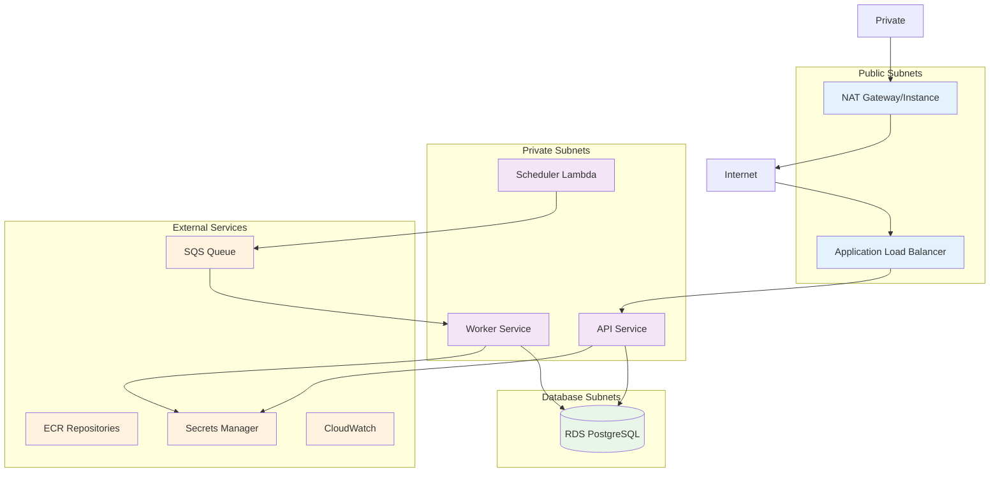
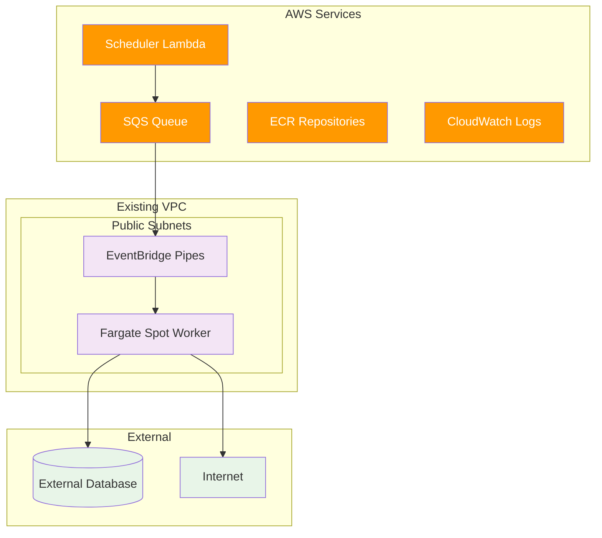

# Infrastructure Documentation

This document provides comprehensive documentation of the Flow Builder infrastructure, covering Terraform modules, AWS services, cost optimization strategies, and deployment processes.

## Infrastructure Overview

Flow Builder supports two primary infrastructure deployment models:

1. **Standard Scalable Infrastructure**: Full-featured deployment with high availability, autoscaling, and comprehensive monitoring
2. **Ultra-Cost-Optimized Infrastructure**: Zero-scale architecture using EventBridge Pipes and Fargate Spot for minimal costs

## Architecture Comparison

| Component | Standard Scalable | Ultra-Cost-Optimized |
|-----------|------------------|----------------------|
| **VPC** | Full VPC with public, private, and database subnets | Existing VPC with public subnets |
| **NAT** | NAT Gateway or NAT Instance | None (uses public subnets) |
| **Database** | RDS PostgreSQL | External (e.g., Render.com) |
| **Compute** | Regular Fargate | Fargate Spot |
| **Scaling** | CloudWatch + Autoscaling | EventBridge Pipes |
| **Monitoring** | Comprehensive dashboards and alarms | Basic CloudWatch logs |
| **High Availability** | Multi-AZ deployment | Single AZ deployment |

## Standard Scalable Infrastructure

### Architecture Diagram



### Key Components

#### 1. Networking Module

**VPC Configuration**:
- **CIDR Block**: 10.0.0.0/16
- **Availability Zones**: 2 (configurable)
- **Subnets**:
  - Public: 10.0.0.0/24, 10.0.1.0/24 (ALB, NAT)
  - Private: 10.0.10.0/24, 10.0.11.0/24 (ECS services)
  - Database: 10.0.20.0/24, 10.0.21.0/24 (RDS)

**Security Groups**:
```hcl
# ALB Security Group
resource "aws_security_group" "alb" {
  ingress {
    from_port   = 80
    to_port     = 80
    protocol    = "tcp"
    cidr_blocks = ["0.0.0.0/0"]
  }
  
  ingress {
    from_port   = 443
    to_port     = 443
    protocol    = "tcp"
    cidr_blocks = ["0.0.0.0/0"]
  }
}

# ECS Security Group
resource "aws_security_group" "ecs" {
  ingress {
    from_port       = 8080
    to_port         = 8080
    protocol        = "tcp"
    security_groups = [aws_security_group.alb.id]
  }
}

# RDS Security Group
resource "aws_security_group" "rds" {
  ingress {
    from_port       = 5432
    to_port         = 5432
    protocol        = "tcp"
    security_groups = [aws_security_group.ecs.id]
  }
}
```

**VPC Endpoints**:
- CloudWatch Logs (Interface)
- SQS (Interface)
- Secrets Manager (Interface)
- S3 (Gateway)

#### 2. Database Module

**RDS PostgreSQL Configuration**:
```hcl
module "db" {
  source = "terraform-aws-modules/rds/aws"
  
  identifier = "${var.name_prefix}-db"
  
  engine         = "postgres"
  engine_version = "15.4"
  instance_class = var.db_instance_class
  
  allocated_storage     = var.db_allocated_storage
  max_allocated_storage = var.db_max_allocated_storage
  
  storage_encrypted = true
  
  db_name  = var.db_name
  username = var.db_username
  password = var.db_password
  
  vpc_security_group_ids = [module.networking.rds_security_group_id]
  db_subnet_group_name   = module.networking.database_subnet_group
  
  backup_retention_period = var.backup_retention_period
  backup_window          = "03:00-04:00"
  maintenance_window     = "sun:04:00-sun:05:00"
  
  deletion_protection = var.env == "prod"
  skip_final_snapshot = var.env != "prod"
}
```

**Environment-Specific Configurations**:
- **Development**: db.t3.micro, 20GB storage, 1-day backup
- **Staging**: db.t3.small, 50GB storage, 7-day backup
- **Production**: db.t3.medium, 100GB storage, 30-day backup

#### 3. ECS Module

**Cluster Configuration**:
```hcl
module "ecs_cluster" {
  source = "terraform-aws-modules/ecs/aws"
  
  cluster_name = "${var.name_prefix}-cluster"
  
  cluster_configuration = {
    execute_command_configuration = {
      logging = "OVERRIDE"
      log_configuration = {
        cloud_watch_log_group_name = aws_cloudwatch_log_group.cluster.name
      }
    }
  }
  
  fargate_capacity_providers = {
    FARGATE = {
      default_capacity_provider_strategy = {
        weight = 50
      }
    }
    FARGATE_SPOT = {
      default_capacity_provider_strategy = {
        weight = 50
      }
    }
  }
}
```

**Service Configuration**:
```hcl
module "api_service" {
  source = "./modules/ecs"
  
  name          = "api"
  cluster_arn   = module.ecs_cluster.cluster_arn
  desired_count = var.api_desired_count
  cpu           = 512
  memory        = 1024
  
  image = "${module.ecr.repository_urls["api"]}:latest"
  
  create_load_balancer = true
  target_group_arn     = aws_lb_target_group.api.arn
  
  env_vars = {
    DB_HOST     = module.db.db_instance_address
    DB_PORT     = module.db.db_instance_port
    DB_NAME     = var.db_name
    DB_USER     = var.db_username
    DB_PASSWORD = var.db_password
    
    CLERK_SECRET_KEY    = var.clerk_secret_key
    CLERK_FRONTEND_URL  = var.clerk_frontend_url
    
    WORKFLOW_QUEUE_URL = module.workflow_queue.queue_url
    AWS_REGION        = var.aws_region
  }
}
```

**Auto Scaling Configuration**:
```hcl
resource "aws_appautoscaling_target" "worker" {
  max_capacity       = var.worker_max_capacity
  min_capacity       = 0
  resource_id        = "service/${module.ecs_cluster.cluster_name}/${module.worker_service.service_name}"
  scalable_dimension = "ecs:service:DesiredCount"
  service_namespace  = "ecs"
}

# Scale up based on SQS queue depth
resource "aws_appautoscaling_policy" "worker_scale_up" {
  name               = "${var.name_prefix}-worker-scale-up"
  policy_type        = "TargetTrackingScaling"
  resource_id        = aws_appautoscaling_target.worker.resource_id
  scalable_dimension = aws_appautoscaling_target.worker.scalable_dimension
  service_namespace  = aws_appautoscaling_target.worker.service_namespace

  target_tracking_scaling_policy_configuration {
    target_value = 5.0  # Target 5 messages per task
    
    customized_metric_specification {
      metric_name = "ApproximateNumberOfVisibleMessages"
      namespace   = "AWS/SQS"
      statistic   = "Average"
      
      dimensions = {
        QueueName = module.workflow_queue.queue_name
      }
    }
  }
}
```

#### 4. Lambda Module

**Scheduler Lambda Configuration**:
```hcl
module "scheduler_lambda" {
  source = "./modules/lambda"
  
  function_name = "${var.name_prefix}-scheduler"
  package_type  = "Image"
  image_uri     = "${module.ecr.repository_urls["scheduler"]}:latest"
  
  memory_size = 512
  timeout     = 300
  
  env_vars = {
    DB_HOST     = module.db.db_instance_address
    DB_PORT     = module.db.db_instance_port
    DB_NAME     = var.db_name
    DB_USER     = var.db_username
    DB_PASSWORD = var.db_password
    
    SQS_URL    = module.workflow_queue.queue_url
    AWS_REGION = var.aws_region
  }
  
  vpc_config = {
    subnet_ids         = module.networking.private_subnets
    security_group_ids = [module.networking.lambda_security_group_id]
  }
}

# EventBridge rule to trigger scheduler every 5 minutes
resource "aws_cloudwatch_event_rule" "scheduler" {
  name                = "${var.name_prefix}-scheduler"
  description         = "Trigger scheduler lambda every 5 minutes"
  schedule_expression = "rate(5 minutes)"
}

resource "aws_cloudwatch_event_target" "scheduler" {
  rule      = aws_cloudwatch_event_rule.scheduler.name
  target_id = "SchedulerLambdaTarget"
  arn       = module.scheduler_lambda.function_arn
}
```

#### 5. Monitoring Module

**CloudWatch Dashboard**:
```hcl
resource "aws_cloudwatch_dashboard" "main" {
  dashboard_name = "${var.name_prefix}-dashboard"

  dashboard_body = jsonencode({
    widgets = [
      {
        type   = "metric"
        width  = 12
        height = 6
        properties = {
          metrics = [
            ["AWS/ECS", "CPUUtilization", "ServiceName", var.api_service_name],
            [".", "MemoryUtilization", ".", "."],
            ["AWS/SQS", "ApproximateNumberOfVisibleMessages", "QueueName", var.queue_name],
            ["AWS/RDS", "CPUUtilization", "DBInstanceIdentifier", var.db_instance_id]
          ]
          period = 300
          stat   = "Average"
          region = var.aws_region
          title  = "System Overview"
        }
      }
    ]
  })
}
```

**CloudWatch Alarms**:
```hcl
# High CPU alarm
resource "aws_cloudwatch_metric_alarm" "high_cpu" {
  alarm_name          = "${var.name_prefix}-high-cpu"
  comparison_operator = "GreaterThanThreshold"
  evaluation_periods  = "2"
  metric_name         = "CPUUtilization"
  namespace           = "AWS/ECS"
  period              = "300"
  statistic           = "Average"
  threshold           = "80"
  alarm_description   = "This metric monitors ECS CPU utilization"
  alarm_actions       = var.alarm_actions

  dimensions = {
    ServiceName = var.api_service_name
  }
}

# Queue backlog alarm
resource "aws_cloudwatch_metric_alarm" "queue_backlog" {
  alarm_name          = "${var.name_prefix}-queue-backlog"
  comparison_operator = "GreaterThanThreshold"
  evaluation_periods  = "2"
  metric_name         = "ApproximateNumberOfVisibleMessages"
  namespace           = "AWS/SQS"
  period              = "300"
  statistic           = "Average"
  threshold           = "100"
  alarm_description   = "This metric monitors SQS queue depth"
  alarm_actions       = var.alarm_actions

  dimensions = {
    QueueName = var.queue_name
  }
}
```

## Ultra-Cost-Optimized Infrastructure

### Architecture Diagram



### Key Components

#### 1. EventBridge Pipes

**Purpose**: Connect SQS queue directly to ECS Fargate tasks for zero-scale architecture.

**Configuration**:
```hcl
resource "aws_pipes_pipe" "worker_pipe" {
  name          = "${var.name_prefix}-worker-pipe"
  role_arn      = aws_iam_role.pipe_role.arn
  source        = var.queue_arn
  target        = data.aws_ecs_cluster.worker_cluster.arn
  desired_state = "RUNNING"

  source_parameters {
    sqs_queue_parameters {
      batch_size                         = 1
      maximum_batching_window_in_seconds = 0
    }
  }

  target_parameters {
    ecs_task_parameters {
      task_definition_arn = aws_ecs_task_definition.worker.arn
      launch_type         = "FARGATE"
      
      capacity_provider_strategy {
        capacity_provider = "FARGATE_SPOT"
        weight           = 100
      }
      
      network_configuration {
        aws_vpc_configuration {
          subnets          = var.subnet_ids
          security_groups  = [aws_security_group.worker.id]
          assign_public_ip = "ENABLED"
        }
      }
      
      overrides {
        container_overrides {
          name = "worker"
          environment {
            name  = "SQS_BODY"
            value = "$.body"
          }
          environment {
            name  = "EVENTBRIDGE_PIPES_MODE"
            value = "true"
          }
          environment {
            name  = "EXIT_AFTER_COMPLETION"
            value = "true"
          }
        }
      }
    }
  }
}
```

**Benefits**:
- **Zero-scale**: Tasks only run when messages exist
- **Cost optimization**: No idle compute costs
- **Automatic scaling**: Scales based on queue depth
- **Fault tolerance**: Failed tasks automatically retry

#### 2. Fargate Spot Configuration

**Task Definition**:
```hcl
resource "aws_ecs_task_definition" "worker" {
  family                   = "${var.name_prefix}-worker"
  network_mode             = "awsvpc"
  requires_compatibilities = ["FARGATE"]
  cpu                      = var.cpu
  memory                   = var.memory
  execution_role_arn       = aws_iam_role.task_execution_role.arn
  task_role_arn           = aws_iam_role.task_role.arn

  container_definitions = jsonencode([
    {
      name  = "worker"
      image = var.image_uri
      
      environment = [
        {
          name  = "POLLING_MODE"
          value = "false"
        },
        {
          name  = "EVENTBRIDGE_PIPES_MODE"
          value = "true"
        },
        {
          name  = "EXIT_AFTER_COMPLETION"
          value = "true"
        },
        {
          name  = "DB_HOST"
          value = var.db_host
        },
        {
          name  = "DB_PORT"
          value = tostring(var.db_port)
        },
        {
          name  = "DB_NAME"
          value = var.db_name
        },
        {
          name  = "DB_USER"
          value = var.db_user
        },
        {
          name  = "DB_PASSWORD"
          value = var.db_password
        }
      ]
      
      logConfiguration = {
        logDriver = "awslogs"
        options = {
          "awslogs-group"         = aws_cloudwatch_log_group.worker.name
          "awslogs-region"        = var.aws_region
          "awslogs-stream-prefix" = "ecs"
        }
      }
    }
  ])
}
```

**Cost Savings**:
- **Spot Pricing**: Up to 90% cost reduction
- **Right-sizing**: Minimal CPU/memory allocation
- **Zero idle time**: Tasks terminate after completion
- **Batch processing**: Efficient resource utilization

## Cost Optimization Strategies

### 1. Development Environment Optimizations

**Infrastructure Choices**:
- **Database**: db.t3.micro (burstable performance)
- **ECS Tasks**: Minimal CPU/memory allocation
- **NAT**: NAT Instance instead of NAT Gateway
- **Monitoring**: Basic CloudWatch logs only
- **Backup**: Reduced retention periods

**Cost Comparison (Monthly)**:
- **Standard Dev**: ~$150-200/month
- **Ultra-Optimized**: ~$20-50/month
- **Savings**: 70-85% cost reduction

### 2. Production Environment Optimizations

**Reserved Instances**:
- RDS Reserved Instances (1-3 year terms)
- ECS Savings Plans for predictable workloads
- CloudWatch Logs retention optimization

**Auto-scaling Policies**:
- Aggressive scale-down during low usage
- Spot instance utilization where appropriate
- Right-sizing based on actual usage patterns

### 3. Resource Right-Sizing

**API Service**:
- **Development**: 0.25 vCPU, 512MB memory
- **Production**: 1 vCPU, 2GB memory

**Worker Service**:
- **Development**: 1 vCPU, 2GB memory
- **Production**: 2 vCPU, 4GB memory

**Lambda Functions**:
- **Scheduler**: 512MB memory, 5-minute timeout
- **Cleanup**: 256MB memory, 2-minute timeout

## Deployment Processes

### 1. Infrastructure Deployment

**Prerequisites**:
```bash
# Install Terraform
curl -fsSL https://apt.releases.hashicorp.com/gpg | sudo apt-key add -
sudo apt-add-repository "deb [arch=amd64] https://apt.releases.hashicorp.com $(lsb_release -cs) main"
sudo apt-get update && sudo apt-get install terraform

# Configure AWS CLI
aws configure
```

**Deployment Steps**:
```bash
# Clone repository
git clone https://github.com/your-org/flow-builder.git
cd flow-builder/infra/tf

# Choose deployment type
cd environments/dev  # or ultra-cost-optimized/

# Initialize Terraform
terraform init

# Plan deployment
terraform plan -var-file="terraform.tfvars"

# Apply infrastructure
terraform apply -var-file="terraform.tfvars"
```

### 2. Application Deployment

**Build and Push Images**:
```bash
# API Service
cd api
docker build -t flow-builder-api .
aws ecr get-login-password | docker login --username AWS --password-stdin $ECR_REGISTRY
docker tag flow-builder-api:latest $ECR_REGISTRY/flow-builder-api:latest
docker push $ECR_REGISTRY/flow-builder-api:latest

# Worker Service
cd ../worker
./build-and-push.sh

# Scheduler Lambda
cd ../scheduler_lambda
./build-and-push.sh
```

**Update ECS Services**:
```bash
# Update API service
aws ecs update-service \
  --cluster flow-builder-cluster \
  --service flow-builder-api \
  --force-new-deployment

# Update worker service
aws ecs update-service \
  --cluster flow-builder-cluster \
  --service flow-builder-worker \
  --force-new-deployment

# Update Lambda function
aws lambda update-function-code \
  --function-name flow-builder-scheduler \
  --image-uri $ECR_REGISTRY/flow-builder-scheduler:latest
```

### 3. Database Migrations

**Migration Process**:
```bash
# Connect to database
psql -h $DB_HOST -U $DB_USER -d $DB_NAME

# Run migrations
python -m alembic upgrade head

# Verify migration
python -c "from shared.db import engine; print('Database connection successful')"
```

### 4. Monitoring Setup

**CloudWatch Configuration**:
```bash
# Create custom metrics
aws logs create-log-group --log-group-name /aws/ecs/flow-builder-api
aws logs create-log-group --log-group-name /aws/ecs/flow-builder-worker
aws logs create-log-group --log-group-name /aws/lambda/flow-builder-scheduler

# Set up alarms
aws cloudwatch put-metric-alarm \
  --alarm-name "flow-builder-high-cpu" \
  --alarm-description "High CPU utilization" \
  --metric-name CPUUtilization \
  --namespace AWS/ECS \
  --statistic Average \
  --period 300 \
  --threshold 80 \
  --comparison-operator GreaterThanThreshold \
  --evaluation-periods 2
```

## Security Considerations

### 1. Network Security

**VPC Security**:
- Private subnets for application services
- Database subnets isolated from internet
- Security groups with least privilege access
- VPC endpoints for AWS service communication

**Access Control**:
- IAM roles with minimal required permissions
- No hardcoded credentials in code
- Secrets Manager for sensitive data
- Regular security group audits

### 2. Data Security

**Encryption**:
- RDS encryption at rest
- EBS volume encryption
- Secrets Manager encryption
- TLS/SSL for data in transit

**Backup and Recovery**:
- Automated RDS backups
- Point-in-time recovery
- Cross-region backup replication (production)
- Disaster recovery procedures

### 3. Application Security

**Authentication**:
- Clerk integration for user management
- JWT token validation
- Guest access with IP-based limits
- Session management and cleanup

**Rate Limiting**:
- Hybrid rate limiting system
- IP-based protection
- User-specific limits
- DDoS protection via CloudFront

## Troubleshooting Guide

### Common Issues

**1. ECS Task Startup Failures**:
```bash
# Check task logs
aws logs get-log-events \
  --log-group-name /aws/ecs/flow-builder-worker \
  --log-stream-name ecs/worker/task-id

# Check task definition
aws ecs describe-task-definition \
  --task-definition flow-builder-worker
```

**2. Database Connection Issues**:
```bash
# Test database connectivity
psql -h $DB_HOST -U $DB_USER -d $DB_NAME -c "SELECT 1;"

# Check security groups
aws ec2 describe-security-groups \
  --group-ids sg-xxxxxxxxx
```

**3. Lambda Function Errors**:
```bash
# Check Lambda logs
aws logs get-log-events \
  --log-group-name /aws/lambda/flow-builder-scheduler \
  --log-stream-name latest

# Test Lambda function
aws lambda invoke \
  --function-name flow-builder-scheduler \
  --payload '{}' \
  response.json
```

**4. EventBridge Pipes Issues**:
```bash
# Check pipe status
aws pipes describe-pipe \
  --name flow-builder-worker-pipe

# Check SQS queue metrics
aws cloudwatch get-metric-statistics \
  --namespace AWS/SQS \
  --metric-name ApproximateNumberOfVisibleMessages \
  --dimensions Name=QueueName,Value=flow-builder-queue \
  --start-time 2024-01-01T00:00:00Z \
  --end-time 2024-01-01T23:59:59Z \
  --period 300 \
  --statistics Average
```

This infrastructure provides a robust, scalable, and cost-efficient foundation for the Flow Builder platform, with options ranging from ultra-cost-optimized development environments to enterprise-grade production deployments.
