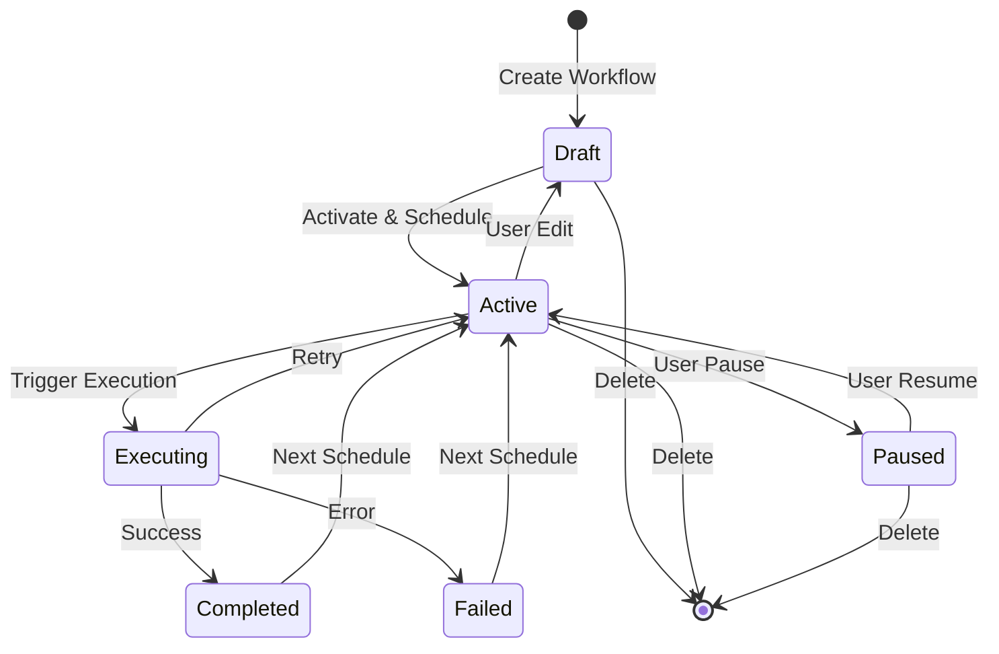

# Workflow System Documentation

This document provides comprehensive documentation of the Flow Builder workflow system, covering workflow creation, scheduling, triggering, and execution through the Lambda-SQS-Fargate pipeline.

## Overview

The Flow Builder workflow system is designed around an event-driven architecture that provides:
- **Visual workflow creation** with drag-and-drop interface
- **Flexible scheduling** using cron expressions
- **Cost-efficient execution** with zero-scale infrastructure
- **Real-time monitoring** with detailed logging
- **Fault tolerance** with automatic retries and error handling

## Workflow Lifecycle



## Workflow Creation

### 1. Visual Workflow Builder

The frontend provides a React Flow-based visual editor where users can:

**Node Types Available:**
- **Browser Nodes**: Launch browsers, fill inputs, click elements
- **Data Extraction**: Get HTML, extract text, AI-powered extraction
- **Data Processing**: JSON transformation, data merging, property manipulation
- **Flow Control**: Conditional branching, loops, delays
- **Communication**: Webhooks, email, SMS delivery
- **Timing**: Delays, element waiting

**Workflow Structure:**
```json
{
  "id": "uuid",
  "name": "Workflow Name",
  "description": "Workflow description",
  "nodes": [
    {
      "id": "node-1",
      "type": "launch_standard_browser",
      "position": {"x": 100, "y": 100},
      "data": {
        "inputs": {
          "Website URL": "https://example.com"
        }
      }
    }
  ],
  "edges": [
    {
      "id": "edge-1",
      "source": "node-1",
      "target": "node-2",
      "sourceHandle": "Web Page",
      "targetHandle": "Web Page"
    }
  ],
  "cron": "0 9 * * 1-5",
  "status": "active"
}
```

### 2. Workflow Validation

Before saving, workflows undergo validation:
- **Node connectivity**: All nodes must be reachable
- **Input/output matching**: Edge connections must match data types
- **Credential requirements**: Required credentials must be available
- **Cron expression**: Schedule must be valid
- **Resource limits**: Workflow complexity within user limits

### 3. Workflow Storage

Workflows are stored in PostgreSQL with:
- **Version control**: Each edit creates a new version
- **Metadata tracking**: Creation time, last modified, execution stats
- **User association**: Workflows belong to specific users
- **Status management**: Draft, active, paused states

## Scheduling System

### 1. Cron-Based Scheduling

Workflows use standard cron expressions for scheduling:

```
┌───────────── minute (0 - 59)
│ ┌───────────── hour (0 - 23)
│ │ ┌───────────── day of month (1 - 31)
│ │ │ ┌───────────── month (1 - 12)
│ │ │ │ ┌───────────── day of week (0 - 6)
│ │ │ │ │
* * * * *
```

**Common Examples:**
- `0 9 * * 1-5`: Every weekday at 9 AM
- `*/15 * * * *`: Every 15 minutes
- `0 0 1 * *`: First day of every month at midnight
- `0 */2 * * *`: Every 2 hours

**Minimum Interval**: 5 minutes (enforced by system)

### 2. Timezone Handling

- **Storage**: All times stored in UTC
- **Display**: Converted to user's timezone in frontend
- **Execution**: Scheduler runs in UTC, converts for display

### 3. Next Run Calculation

The system calculates next run times using the `croniter` library:

```python
from croniter import croniter
from datetime import datetime, timezone

def get_next_run_date(cron_expression: str) -> datetime:
    """Calculate next run time from cron expression."""
    now = datetime.now(timezone.utc)
    cron = croniter(cron_expression, now)
    return cron.get_next(datetime)
```

## Execution Pipeline

### 1. Lambda Scheduler

**Trigger**: EventBridge rule every 5 minutes

**Process:**
1. Query database for workflows where `next_run_at <= now()`
2. For each due workflow:
   - Create execution record in database
   - Send message to SQS queue
   - Update `next_run_at` to next occurrence
   - Update `last_run_at` timestamp

**Message Format:**
```json
{
  "execution_id": "uuid",
  "workflow_id": "uuid", 
  "user_id": "uuid",
  "trigger": "scheduled",
  "status": "queued",
  "queued_at": "2024-01-01T12:00:00Z"
}
```

**Error Handling:**
- Database connection failures: Retry with exponential backoff
- SQS send failures: Log error, continue with other workflows
- Invalid cron expressions: Skip workflow, log error

### 2. SQS Queue

**Configuration:**
- **Queue Type**: Standard SQS queue
- **Visibility Timeout**: 15 minutes (longer than max execution time)
- **Dead Letter Queue**: For failed messages after 3 retries
- **Message Retention**: 14 days

**Benefits:**
- **Decoupling**: Scheduler and workers operate independently
- **Reliability**: Messages persist until processed
- **Scalability**: Queue handles traffic spikes
- **Monitoring**: CloudWatch metrics for queue depth

### 3. EventBridge Pipes

**Purpose**: Connect SQS queue to ECS Fargate tasks

**Configuration:**
```hcl
resource "aws_pipes_pipe" "worker_pipe" {
  source = aws_sqs_queue.workflow_queue.arn
  target = aws_ecs_cluster.worker_cluster.arn
  
  source_parameters {
    sqs_queue_parameters {
      batch_size = 1
      maximum_batching_window_in_seconds = 0
    }
  }
  
  target_parameters {
    ecs_task_parameters {
      task_definition_arn = aws_ecs_task_definition.worker.arn
      launch_type = "FARGATE"
      capacity_provider_strategy {
        capacity_provider = "FARGATE_SPOT"
        weight = 100
      }
    }
  }
}
```

**Benefits:**
- **Zero-scale**: Tasks only run when messages exist
- **Cost optimization**: No idle compute costs
- **Automatic scaling**: Scales based on queue depth
- **Fault tolerance**: Failed tasks automatically retry

### 4. Fargate Worker Execution

**Worker Startup:**
1. Task receives message via environment variable `SQS_BODY`
2. Parse message to extract execution details
3. Connect to database and retrieve workflow
4. Initialize execution environment

**Execution Process:**
1. **Phase Planning**: Organize nodes into execution phases
2. **Environment Setup**: Initialize browser, credentials, variables
3. **Node Execution**: Execute nodes in dependency order
4. **Result Collection**: Gather outputs and logs
5. **Status Update**: Mark execution as completed/failed
6. **Cleanup**: Close browsers, clean up resources
7. **Task Termination**: Exit with appropriate status code

**Phase Execution:**
```python
async def run_nodes_in_phase(self, execution, phase_info, all_edges, env):
    """Execute all nodes in a phase concurrently."""
    phase_nodes = phase_info["nodes"]
    
    # Create phase record in database
    phase = await create_phase(
        session=self.session,
        execution_id=execution.id,
        phase_number=phase_info["phase_number"],
        node_count=len(phase_nodes)
    )
    
    # Execute nodes concurrently
    tasks = []
    for node in phase_nodes:
        task = self.execute_node(node, env, phase)
        tasks.append(task)
    
    # Wait for all nodes to complete
    results = await asyncio.gather(*tasks, return_exceptions=True)
    
    # Update phase status
    await update_phase_status(self.session, phase, results)
    
    return sum(node_credits for node_credits in results if isinstance(node_credits, int))
```

## Node Execution System

### 1. Node Registry

All node types are registered in a central registry:

```python
NODE_REGISTRY = {
    "launch_standard_browser": StandardBrowserNode,
    "launch_stealth_browser": StealthBrowserNode,
    "launch_bright_data_browser": BrightDataBrowserNode,
    "fill_input": FillInputNode,
    "click_element": ClickElementNode,
    "get_html": GetHTMLNode,
    "get_text_from_html": GetTextFromHTMLNode,
    "extract_data_openai": OpenAICallNode,
    # ... more nodes
}
```

### 2. Node Base Class

All nodes inherit from `NodeExecutor`:

```python
class NodeExecutor:
    required_input_keys = []  # Required inputs
    output_keys = []          # Produced outputs
    can_be_start_node = False # Can start workflow
    
    async def run(self, node: Node, env: Environment) -> Dict[str, Any]:
        """Execute the node and return outputs."""
        raise NotImplementedError
    
    def validate(self, node: Node, env: Environment):
        """Validate node inputs before execution."""
        for key in self.required_input_keys:
            if key not in node.inputs:
                raise ValueError(f"Missing required input: {key}")
```

### 3. Environment Management

The execution environment maintains:
- **Browser instances**: Shared across browser nodes
- **Variables**: Data passed between nodes
- **Credentials**: Securely accessed secrets
- **Phases**: Execution phase tracking
- **Logs**: Detailed execution logs

```python
class Environment:
    def __init__(self):
        self.browser = None
        self.page = None
        self.variables = {}
        self.phases = {}
        self.credentials = {}
    
    def set_variable(self, key: str, value: Any):
        """Store variable for use by other nodes."""
        self.variables[key] = value
    
    def get_variable(self, key: str) -> Any:
        """Retrieve variable set by previous nodes."""
        return self.variables.get(key)
```

## Error Handling & Monitoring

### 1. Error Types

**Node Execution Errors:**
- Invalid inputs or configuration
- Network timeouts or connection failures
- Browser automation failures
- External API errors

**System Errors:**
- Database connection failures
- Memory or resource exhaustion
- Task timeout (15-minute limit)
- Infrastructure failures

### 2. Error Recovery

**Automatic Retries:**
- SQS message redelivery (up to 3 times)
- Exponential backoff for transient failures
- Dead letter queue for persistent failures

**Graceful Degradation:**
- Continue execution if non-critical nodes fail
- Partial results saved for debugging
- Detailed error logs for troubleshooting

### 3. Monitoring & Logging

**Execution Logs:**
- Node-level logs with timestamps
- Error details and stack traces
- Performance metrics (execution time, memory usage)
- Browser automation screenshots on failures

**System Metrics:**
- Queue depth and processing time
- Task success/failure rates
- Resource utilization
- Cost tracking per execution

**Alerting:**
- High failure rates
- Queue backlog alerts
- Resource exhaustion warnings
- Cost threshold notifications

## Trigger Types

### 1. Scheduled Triggers

- **Cron-based**: Regular intervals using cron expressions
- **One-time**: Single execution at specified time
- **Conditional**: Based on external events or data changes

### 2. Manual Triggers

- **User-initiated**: Direct execution from UI
- **API-triggered**: Webhook or API call
- **Testing**: Development and debugging executions

### 3. Event-driven Triggers

- **Webhook**: External system notifications
- **File changes**: S3 bucket notifications
- **Database changes**: Trigger on data updates
- **Time-based**: Specific dates or intervals

## Performance Optimization

### 1. Execution Optimization

- **Parallel execution**: Nodes run concurrently when possible
- **Resource pooling**: Shared browser instances
- **Caching**: Reuse of computed results
- **Lazy loading**: Load resources only when needed

### 2. Cost Optimization

- **Spot instances**: Up to 90% cost savings
- **Right-sizing**: Optimal resource allocation
- **Efficient scheduling**: Batch similar workflows
- **Resource cleanup**: Immediate cleanup after execution

### 3. Scalability

- **Horizontal scaling**: Multiple workers process queue
- **Queue-based architecture**: Handles traffic spikes
- **Stateless workers**: Easy to scale up/down
- **Database optimization**: Efficient queries and indexing

This workflow system provides a robust, scalable, and cost-efficient foundation for automating complex browser-based workflows while maintaining enterprise-grade reliability and monitoring capabilities.
