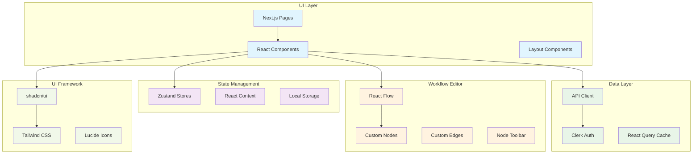

# Flow Builder Frontend

Modern React/Next.js frontend for the Flow Builder workflow automation platform.

## Architecture

## Features

### Core Features
- **Visual Workflow Editor**: Drag-and-drop workflow creation with React Flow
- **Real-time Updates**: Live execution monitoring and status updates
- **Responsive Design**: Mobile-friendly interface with Tailwind CSS
- **Dark/Light Mode**: Theme switching with system preference detection
- **Type Safety**: Full TypeScript support throughout the application

### Authentication & User Management
- **Clerk Integration**: Secure authentication with social logins
- **Guest Access**: Trial mode with no signup required
- **User Dashboard**: Personalized dashboard with usage statistics
- **Session Management**: Automatic session handling and renewal

### Workflow Management
- **Visual Editor**: Intuitive drag-and-drop workflow builder
- **Node Library**: Extensive collection of pre-built workflow nodes
- **Real-time Validation**: Instant feedback on workflow configuration
- **Version Control**: Workflow versioning with visual diff
- **Execution Monitoring**: Live execution tracking with detailed logs

### UI/UX Features
- **Modern Design**: Clean, professional interface
- **Accessibility**: WCAG compliant components
- **Performance**: Optimized for fast loading and smooth interactions
- **Internationalization**: Ready for multi-language support