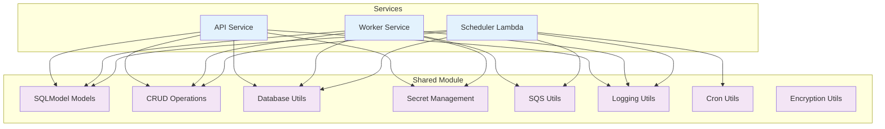

# Shared Module

This module contains shared utilities, models, and database operations used across all Flow Builder services (API, Worker, Scheduler Lambda).

## Overview

The shared module provides common functionality to ensure consistency and reduce code duplication across services:



## Module Structure

```
shared/
├── __init__.py              # Module initialization
├── models.py               # SQLModel database models
├── db.py                   # Database configuration and sessions
├── crud/                   # Database CRUD operations
│   ├── __init__.py
│   ├── workflow_crud.py    # Workflow operations
│   ├── execution_crud.py   # Execution operations
│   ├── credentials_crud.py # Credential operations
│   ├── balance_crud.py     # User balance operations
│   ├── phase_crud.py       # Execution phase operations
│   ├── log_crud.py         # Logging operations
│   └── db_secret_crud.py   # Database secret operations
├── secrets.py              # Secret management utilities
├── sqs.py                  # SQS messaging utilities
├── logging.py              # Logging configuration
├── cron.py                 # Cron expression utilities
└── crypto.py               # Encryption utilities
```

## Core Components

### Database Models (models.py)

Defines all SQLModel database models used across services:

**User Management**:
- `User` - User accounts (both authenticated and guest)
- `UserBalance` - Credit balance tracking
- `GuestSession` - Guest session management

**Workflow System**:
- `Workflow` - Workflow definitions
- `WorkflowVersion` - Workflow versioning
- `WorkflowExecution` - Execution records
- `ExecutionPhase` - Execution phase tracking
- `ExecutionLog` - Detailed execution logs

**Security**:
- `Credential` - Stored credentials
- `DatabaseSecret` - Encrypted database secrets
- `RateLimitEntry` - Rate limiting tracking

### Database Configuration (db.py)

Provides database connection and session management:

```python
from shared.db import get_session, create_engine_and_session

# Get async session for API/Worker
async with get_session() as session:
    # Database operations
    pass

# Get session for Lambda (different pattern)
engine, SessionLocal = create_lambda_engine_and_session()
async with SessionLocal() as session:
    # Lambda database operations
    pass
```

**Features**:
- Async SQLAlchemy sessions
- Connection pooling
- Environment-specific configuration
- Lambda-optimized session handling

### CRUD Operations (crud/)

Database operations organized by entity type:

**Workflow CRUD** (`workflow_crud.py`):
```python
from shared.crud.workflow_crud import (
    create_workflow,
    get_workflow_by_id_and_user,
    update_workflow,
    delete_workflow,
    get_due_workflows
)
```

**Execution CRUD** (`execution_crud.py`):
```python
from shared.crud.execution_crud import (
    create_execution,
    get_execution_by_id_and_user,
    update_execution_status,
    list_executions_for_user
)
```

**Credential CRUD** (`credentials_crud.py`):
```python
from shared.crud.credentials_crud import (
    get_credential_by_id,
    list_credentials_for_user,
    delete_credential
)
```

### Secret Management (secrets.py)

Unified secret management supporting both AWS Secrets Manager and database encryption:

```python
from shared.secrets import create_secret, retrieve_secret, delete_secret

# Create secret (automatically chooses storage method)
secret_arn = await create_secret(
    session=session,
    secret_name="api-key",
    secret_value="secret-value",
    user_id=user_id
)

# Retrieve secret
secret_value = await retrieve_secret(secret_arn, session, user_id)

# Delete secret
success = await delete_secret(session, secret_arn, user_id)
```

**Storage Methods**:
- AWS Secrets Manager (production)
- Database encryption (development/cost-optimized)

### SQS Utilities (sqs.py)

SQS messaging operations for workflow execution:

```python
from shared.sqs import send_message, receive_messages, delete_message

# Send workflow execution message
send_message(
    queue_url=queue_url,
    message_body=json.dumps(execution_data)
)

# Receive messages (worker polling)
messages = receive_messages(
    queue_url=queue_url,
    max_number=5,
    wait_time=20
)

# Delete processed message
delete_message(
    queue_url=queue_url,
    receipt_handle=receipt_handle
)
```

### Logging Configuration (logging.py)

Structured logging setup for all services:

```python
from shared.logging import get_logger, setup_logging

# Setup logging (call once per service)
setup_logging()

# Get logger for module
logger = get_logger(__name__)

# Use structured logging
logger.info("Processing workflow", extra={
    "workflow_id": workflow_id,
    "user_id": user_id,
    "execution_id": execution_id
})
```

**Features**:
- JSON structured logging
- Environment-specific log levels
- Correlation ID support
- CloudWatch integration

### Cron Utilities (cron.py)

Cron expression parsing and next run calculation:

```python
from shared.cron import get_next_run_date, validate_cron_expression

# Calculate next run time
next_run = get_next_run_date("0 9 * * 1-5")  # Weekdays at 9 AM

# Validate cron expression
is_valid = validate_cron_expression("0 */2 * * *")  # Every 2 hours
```

### Encryption Utilities (crypto.py)

Database secret encryption for cost-optimized deployments:

```python
from shared.crypto import DatabaseSecretManager

manager = DatabaseSecretManager()

# Encrypt secret for database storage
encrypted_value = manager.encrypt_secret("secret-value")

# Decrypt secret from database
decrypted_value = manager.decrypt_secret(encrypted_value)
```

**Security Features**:
- AES-256 encryption
- PBKDF2 key derivation
- Configurable salt and password
- Secure key management

## Usage Patterns

### Service Integration

**API Service**:
```python
from shared.models import User, Workflow
from shared.crud.workflow_crud import create_workflow
from shared.db import get_session
from shared.logging import get_logger

logger = get_logger(__name__)

async def create_workflow_endpoint(workflow_data, user):
    async with get_session() as session:
        workflow = await create_workflow(session, user.id, workflow_data)
        logger.info("Created workflow", extra={"workflow_id": workflow.id})
        return workflow
```

**Worker Service**:
```python
from shared.models import WorkflowExecution, ExecutionStatus
from shared.crud.execution_crud import update_execution_status
from shared.secrets import retrieve_secret
from shared.sqs import receive_messages

async def process_workflow_execution():
    messages = receive_messages(queue_url)
    for message in messages:
        # Process workflow
        await update_execution_status(session, execution_id, ExecutionStatus.COMPLETED)
```

**Scheduler Lambda**:
```python
from shared.crud.workflow_crud import get_due_workflows
from shared.cron import get_next_run_date
from shared.sqs import send_message

async def schedule_workflows():
    workflows = await get_due_workflows(session)
    for workflow in workflows:
        # Send to execution queue
        send_message(queue_url, execution_message)
        # Update next run time
        workflow.next_run_at = get_next_run_date(workflow.cron)
```

## Environment Configuration

The shared module respects environment variables for configuration:

**Database**:
- `DB_HOST`, `DB_PORT`, `DB_NAME`, `DB_USER`, `DB_PASSWORD`
- `DB_SSL_MODE` - SSL configuration

**Secrets**:
- `USE_DB_SECRETS` - Use database encryption vs AWS Secrets Manager
- `SECRET_ENCRYPTION_PASSWORD` - Database encryption password
- `SECRET_ENCRYPTION_SALT` - Database encryption salt

**SQS**:
- `SQS_ENDPOINT_URL` - Custom SQS endpoint (LocalStack)
- `AWS_REGION` - AWS region

**Logging**:
- `LOG_LEVEL` - Logging level (DEBUG, INFO, WARNING, ERROR)
- `DEBUG_MODE` - Enable debug logging

## Testing

The shared module includes utilities for testing:

```python
# Test database setup
from shared.db import create_test_engine_and_session

# Test with in-memory database
engine, SessionLocal = create_test_engine_and_session()

# Test secret management
from shared.secrets import create_secret, retrieve_secret

# Test with database secrets
os.environ['USE_DB_SECRETS'] = 'true'
secret_arn = await create_secret(session, "test", "value", user_id)
```

## Dependencies

**Core Dependencies**:
- `sqlmodel` - Database ORM
- `sqlalchemy` - Database toolkit
- `asyncpg` - PostgreSQL async driver
- `boto3` - AWS SDK
- `cryptography` - Encryption utilities
- `croniter` - Cron expression parsing

**Optional Dependencies**:
- `redis` - Redis caching (if enabled)
- `localstack` - Local AWS emulation (development)

This shared module provides the foundation for all Flow Builder services, ensuring consistency, reliability, and maintainability across the entire system.
